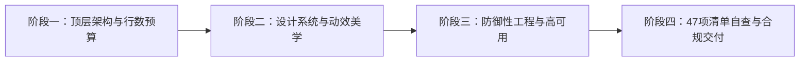

# 🌟 Fullstack Craft Perfection (全栈极致工匠体系)

<p align="center">
  <strong>专为 AI Coding、Agentic Assistant 与资深工程师打造的全栈架构韧性与国际获奖级美学落地体系</strong>
</p>

<p align="center">
  
  
  
  
  
</p>

---

## 📖 项目简介 (Overview)

在 AI 辅助研发时代，大模型普遍存在 **过度工程化（100行写成500行）、代码堆积与僵尸残留、同功能重复造轮子、API与端点凭空捏造、修改引入毁灭性副作用（爆炸半径盲区）、表面跑通但暗藏隐性Bug** 等致命痛点。

**Fullstack Craft Perfection** 是一套开箱即用的**系统级工程技能包（Skill Package & Rule Framework）**。它将 **资深系统架构师（Staff/Principal Engineer）的防御性工程韧性** 与 **设计总监（Design Director）的国际获奖级视觉美学（Awwwards / Webby / FWA Tier）** 熔铸于一体，专为约束和激发 AI 智能体（如 Google Antigravity、Cursor、Claude Code、Windsurf 等）产出工业生产级、可长期维护的高水准代码。

---

## 🎯 核心解决的 11 大 AI 编码痛点

| # | AI 典型缺陷 / 顽疾 | 本体系给出的硬性工程解法 |
|---|---|---|
| 1 | **代码堆积与臃肿** | **彻底斩断式重构 (Clean-Cut)**：方案演进必须连根清理旧实现，坚决杜绝半成品并存。 |
| 2 | **重复造轮子** | **前置资产查重 (Pre-Coding Audit)**：动手前强制检索现有公共库，优先复用与扩展。 |
| 3 | **缺乏全局理解** | **源码全链路精准追踪**：从业务入口严密推演至底层，拒绝孤岛式打补丁。 |
| 4 | **架构逐渐失控** | **阶梯式行数健康预算**（常规 1200~1800 行，核心大文件放宽至 3000 行，语言包 `.po` 显式豁免）+ **前置组合设计**。 |
| 5 | **同功能多套实现 (A/B/C版)** | **单一真实来源 (SSOT)**：核心业务计算全库有且仅允许保留一套权威标准入口。 |
| 6 | **代码风格与设计漂移** | **周边风格自然融合 + 系统化 Design Tokens**：零散魔数全部收敛为 CSS Variables。 |
| 7 | **修改容易引入副作用** | **反向依赖爆炸半径走查 (Blast Radius)**：修改公共代码强制反查所有调用方，确保向下兼容。 |
| 8 | **过度工程化 (Over-engineering)** | **奥卡姆剃刀与代码经济 (KISS & Anti-YAGNI)**：如无必要勿增实体，消灭无用抽象层。 |
| 9 | **过度追求局部最佳** | **超越局部短函数，全局系统自洽**：推演并发、事务、降级与优雅停机因果链。 |
| 10 | **Debug 困难** | **Trace-ID 全链路追踪 + 根因直击**：严禁盲目加 if 或空套 try-catch 掩盖报错。 |
| 11 | **隐性 Bug 与假阳性** | **全维度极值推演 (Null/0/负数/溢出) + 状态机单向流转 + 并发绝对幂等 + 行级越权防护**。 |

---

## 🏗️ 目录结构 (Repository Structure)

```bash
fullstack-craft-perfection/
├── SKILL.md                          # 核心技能定义与 47 项自查清单工作流
├── README.md                         # 项目主说明文档
├── LICENSE                           # MIT 开源许可证
├── references/                       # 架构与设计规范落地指南
│   ├── design-tokens.css             # 工业级 CSS 变量体系 (色彩梯阶、4px网格、贝塞尔曲线)
│   ├── ui-8-states-guide.md          # 国际获奖级 UI 交互 8 态生命周期闭环指南
│   └── backend-resilience.md         # 后端弹性架构：幂等性、DTO隔离、软删除、Trace-ID实战
└── examples/
    └── award-winning-component.html  # 零依赖自洽的获奖级交互组件示范代码
```

---

## ⚡ 四阶段核心研发工作流 (Four-Phase Workflow)



### 阶段一：顶层架构与行数预算 (Architecture & Line Budget)
- **阶梯式行数健康预算**：常规业务文件建议 `1200 ~ 1800` 行；复杂聚合容器、大型单页与核心领域 Service 上限放宽至 `2500 ~ 3000` 行（仅超过 3000 行才强制拆分，杜绝碎片化过度抽象）；函数保持在 `120 ~ 150` 行（复杂事务/状态机至 200 行）。
- **语言包与静态配置显式豁免**：多语言翻译文件（如 `.po`, `.pot`, `.mo`、i18n JSON 字典）、静态表结构列配置（Column Schema）与第三方依赖完全不受行数限制。
- **前置架构组合拆分**：前端页面作为纯容器装配层，子组件与 Hooks 独立；后端 Controller 调度、Service 核心下沉。
- **奥卡姆剃刀 (KISS & Anti-YAGNI)**：禁止为简单功能构建多层抽象工厂或空转包装类，每一行代码必须有当下明确业务价值。

### 阶段二：设计系统与获奖级美学 (Design System & Craft)
- **Design Tokens 驱动（消灭散落魔数）**：全局色彩、间距、字阶、圆角全部收敛于 CSS 变量。
- **UI 交互 8 态闭环**：`Default`、`Hover`、`Active`、`Focus-Visible`、`Loading/Skeleton`、`Empty`、`Error`、`Disabled` 全态覆盖。
- **动效 GPU 合成层铁律**：动效与过渡严格限定于 `transform` 与 `opacity`，贝塞尔曲线精准调校，全端满帧 60/120fps。
- **微文案克制 (Microcopy)**：常规操作按钮保持 **2~6 个字**（上限 8 字），标签 **2~4 个字**，强制配置 `white-space: nowrap;` 防折行。
- **严禁滥用 Emoji**：禁止使用系统原生 Emoji 充当功能图标（防跨端渲染割裂与廉价感）；支持标准 SVG、阿里 Iconfont (`iconfont icon-xxx`)、Remix Icon、FontAwesome 及后台外链自定义注入。

### 阶段三：防御性工程与高可用系统韧性 (Defensive Engineering)
- **行级数据归属鉴权 (防 IDOR 水平越权)**：私有数据操作强制在持久层绑定用户上下文（`WHERE id = ? AND user_id = ?`）。
- **核心数据软删除 (Soft Delete)**：核心业务数据严禁物理 `DELETE`，使用 `deleted_at IS NULL` 维护历史追溯与唯一键安全。
- **个人敏感信息 (PII) 掩码与日志脱敏**：手机号、邮箱、身份证对外强脱敏；日志中严禁明文打印密码与凭证。
- **数据库无损演进 (Expand-Contract 模式)**：DDL 脚本重入幂等；严禁破坏性瞬间删列，遵循“扩充 $\to$ 双写回填 $\to$ 读切换 $\to$ 清理”四步法。
- **第三方 API 100% 实证对齐**：严禁凭空捏造请求 URL 端点、参数与返回字段，解析必须严格依据官方最新真实文档。
- **写操作绝对幂等与防并发穿透**：服务端三级防线（请求在途互斥锁、数据库唯一索引、状态机单向流转）。
- **全链路可观测性 (Trace-ID) 与优雅停机 (Graceful Shutdown)**：常驻进程监听退出信号完成事务后安全退出。

---

## 📋 47 项全生命周期自查清单 (47-Item Master Checklist)

每次交付代码前，对照以下 47 项标准自查，杜绝违规交付：

```markdown
1.  [ ] 是否通过调用链精准追踪到了功能对应的实际生效源码，而非仅靠泛关键词盲改？
2.  [ ] 是否遵守了特定环境的无本地测试约束？
3.  [ ] 第三方 API 调用（接口端点URL、请求参数、鉴权签名及返回字段层级）是否 100% 对齐官方最新真实文档，杜绝凭空瞎编虚构？
4.  [ ] 新增/修改的代码是否符合项目原本的架构风格，没有引入不搭调的新结构？
5.  [ ] CSS 修改是否在原选择器处直接修改，而不是在文件末尾追加强制覆盖样式？
6.  [ ] SQL 操作是否全部使用预处理绑定参数，无字符串拼接？
7.  [ ] 前端 HTML 动态输出是否均已进行 XSS 转义防护？
8.  [ ] 代码中是否没有任何硬编码的 API 密钥或敏感密码？
9.  [ ] 原有的关键注释与上下文业务逻辑是否完好保留？
10. [ ] 错误处理是否已安全捕获并记录日志，不泄漏系统报错堆栈？
11. [ ] JavaScript 操作 DOM 前是否已进行非空校验？
12. [ ] 目录中是否有无用的 .bak 或临时测试文件残留？
13. [ ] 第三方 HTTP 请求是否均已设置显式超时与失败兜底逻辑？
14. [ ] 高频接口是否合理配置了缓存与防刷限流机制？
15. [ ] 数据库更新/删除操作是否有 WHERE 条件，查询是否使用了 LIMIT？
16. [ ] 修改既有接口时是否保证了对老前端/外部调用方的向下兼容？
17. [ ] Cookie 与 Session 是否设置了 HttpOnly、SameSite 等安全属性？
18. [ ] 文件是否全部保存为 UTF-8 无 BOM 编码，无隐藏输出字符？
19. [ ] 敏感文件（如 .env）是否已加入 .gitignore 保护不被提交？
20. [ ] API 接口是否统一返回 {"code", "msg", "data"} 格式及 JSON 响应头？
21. [ ] 前端 UI 是否适配移动端与小程序，按钮与标签文案是否克制（常规2~6字，上限8字，防折行撑爆容器）？
22. [ ] 文件/cURL 句柄使用完毕后是否均已显式关闭释放？
23. [ ] 处理中文或多字节字符串是否全部使用 mb_* 系列函数？
24. [ ] 定时任务与异步作业是否具备幂等性与运行锁保护？
25. [ ] 前端 UI 页面上是否没有任何开发内部字段名、调试报错堆栈、代码变量或 AI 对话文案泄漏？
26. [ ] 自研业务单文件是否维持在阶梯健康预算内（常规1200~1800行，核心聚合大文件上限3000行，语言文件.po等完全豁免），函数是否保持在150~200行内？
27. [ ] 循环体内是否没有任何 SQL 查询或第三方 HTTP API 调用，确保高效性能？
28. [ ] 变量与属性访问前是否全部进行了严格的非空类型校验？
29. [ ] 域名、IP、路径等配置是否完全从代码中解耦提取？
30. [ ] 第三方依赖包的 Lock 锁文件是否已被完整保留？
31. [ ] 涉及多表变更的操作是否已包裹在数据库事务中，且异常时安全回滚？
32. [ ] 前端 UI 与交互是否以 Awwwards/Webby/FWA 获奖级水准为标杆进行了自查与反复迭代打磨？
33. [ ] 样式是否基于系统化 Design Tokens 构建（零魔数），交互组件是否具备完整的 8 态生命周期闭环？
34. [ ] 外部数据注入视图前是否进行了 Data Normalizer 防崩清洗，事件监听/定时器/第三方实例是否在生命周期注销时 100% 释放？
35. [ ] 后端接口是否通过强类型 DTO 白名单隔离过滤入参，关键写操作是否在服务端实现了绝对幂等？
36. [ ] 是否具备 Trace-ID 全链路日志可观测性，外部重试是否有防雪崩退避机制，常驻进程是否支持优雅停机？
37. [ ] 图片上传功能是否默认配置了压缩与尺寸预算（除非特殊原图需求），并具备文件魔数校验与隐私安全防护？
38. [ ] 是否践行了全栈性能预算（按需字段投影、长列表DOM预算/虚拟滚动、图片懒加载、高频事件防抖节流及 O(N) 哈希索引化）？
39. [ ] 界面是否杜绝原生 Emoji 充当图标，图标方案是否支持阿里 Iconfont / Remix Icon / FontAwesome / Iconify 等规范类名前缀（如 iconfont icon-、ri-、fa-）及后台外链自定义输入？
40. [ ] 是否实施了数据行级归属鉴权（防IDOR水平越权）、核心资产软删除、PII隐私脱敏及数据库无损平滑演进？
41. [ ] 是否恪守了奥卡姆剃刀与极简原则（KISS），杜绝简单问题复杂化、过度抽象与行数膨胀？
42. [ ] 是否完成了彻底斩断式重构，100% 清理了废弃死代码，杜绝新旧方案混杂与相互牵制？
43. [ ] 调用的 API 与语法是否与当前环境及依赖版本完全匹配，杜绝使用废弃 API 与编造幻觉函数？
44. [ ] 是否具备宏观全局架构观，复用了既有公共设施，确保改动与整个系统的分层和生命周期高度自洽？
45. [ ] 修改公共方法/组件/字段时，是否反向检索了所有调用方并评估了“爆炸半径”，杜绝引入副作用？
46. [ ] 编写代码前是否进行了“前置资产查重”，优先复用既有组件/工具，确保业务逻辑为单一真实来源（SSOT）？
47. [ ] 是否进行了全维度极值边界推演（空值/0/负数/并发/超时），排查跨模块问题是否直击根因而非表面打补丁？
```

---


## 📄 开源许可证 (License)

本项目基于 [MIT License](LICENSE) 开源。欢迎 Star、Fork 与提交 PR，共同构筑更纯净、更高水准的 AI 研发工程生态！
