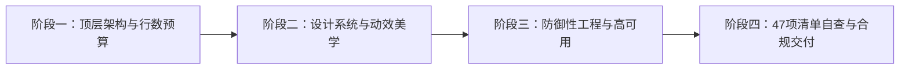

# 全栈资深架构师与设计总监通用工程技能包 (Fullstack Craft Perfection)

本技能包专为实现**生产级可靠性与韧性（Staff/Principal Engineer）**与**国际获奖级视觉美学（Awwwards / Webby / FWA Tier）**的双重融合而设计。适用于任何技术栈、任何规模的通用软件研发与架构落地。

---

## 核心工作流：从需求到交付的四阶段规范

---

## 阶段一：顶层架构与模块化行数预算 (Architecture & Line Budget)

在动手编写任何业务代码前，必须进行**前置组合设计（Upfront Composition）**，坚决消灭单体巨文件（God File）：

1. **自研业务单文件行数红线**：
   - **舒适区间**：建议保持在 `800 ~ 1000` 行以内；
   - **绝对物理上限**：**严禁超过 1500 行**；
   - **函数粒度控制**：单个函数/方法保持在 `80 ~ 100` 行内，职责单一。
2. **前置拆分与组合范式**：
   - **前端复杂大功能**：主页面只作为**容器装配层**，按业务区块拆为独立子组件（Subcomponents），状态与异步数据抽离为 Hooks / Store / Service，工具函数抽取为 Helper。
   - **后端复杂系统**：Controller 仅负责入参调度与响应封装，核心业务领域下沉至 Service，数据持久化交给 Model / Repository，算法抽取为 Helper。
3. **第三方依赖豁免**：
   - 外部开源依赖、SDK、包管理器目录（`vendor/`, `node_modules/`）、编译构建产物（`dist/`）及大字典配置文件完全豁免。
4. **宏观全局架构观与拒绝过度工程 (Holistic Architecture & Anti-Overengineering)**：
   - **全局系统视野**：面对大型复杂工程，必须从系统整体高度理解领域边界与生命周期；优先复用既有 Service/Helper/异常体系，坚决杜绝因盲目写碎函数导致轮子碎片化与架构撕裂；
   - **奥卡姆剃刀与极简实现 (KISS)**：严禁简单问题复杂化（杜绝 100 行可解决的问题写成 500 行弯弯绕绕）；杜绝为了虚无缥缈的未来扩展性（YAGNI）而滥用多层工厂、空转包装与过度抽象。

---

## 阶段二：设计系统与国际获奖级美学 (Design System & Visual Craft)

所有界面设计与微交互必须以 **Awwwards / Webby / FWA 获奖级作品** 为品质基准：

1. **系统化 Design Tokens 驱动（消灭魔数）**：
   - 页面样式必须建立在系统化 CSS 变量之上（统一的色彩阶梯、间距网格、字阶比例、投影光泽与缓动曲线）；
   - 参考标准变量池：[design-tokens.css](./references/design-tokens.css)。
2. **UI 交互 8 态完整生命周期闭环**：
   - 任何具备交互或数据承载的组件，必须推敲并实现 8 态闭环：
     `Default` → `Hover` → `Active/Press` → `Focus-Visible` → `Skeleton/Loading` → `Empty` → `Error/Fallback` → `Disabled`；
   - 详见落地规范：[ui-8-states-guide.md](./references/ui-8-states-guide.md)。
3. **动效物理定律与 GPU 合成层铁律**：
   - **属性限定**：动效与过渡严格限制在 `transform` 与 `opacity`，严禁使用引发重排（Reflow）的盒模型属性做动画；
   - **缓动曲线**：采用经过调校的贝塞尔曲线（如 `cubic-bezier(0.16, 1, 0.3, 1)`），保证全端满帧 60/120fps。
4. **移动端响应式与微文案克制 (Microcopy Economy)**：
   - 绝不使用固定死宽大值导致水平滚动；
   - **按钮与标签文字克制**：常规操作按钮保持在 **2~6 个字**（如“保存”、“确认支付”、“下载报表”），复合或带状态操作**严禁超过 8 个字**；标签/徽标控制在 **2~4 个字**；严禁塞入说明性长句，补充说明必须剥离至辅助提示行；
   - **防折行保底**：按钮与标签强制设置 `white-space: nowrap;`，杜绝小屏/小程序下折行变形；
   - 移动端点击区域与按钮尺寸必须保证 $\ge 44 \times 44\text{px}$ 规范触控面积。
5. **UI 图标工程化与严禁滥用 Emoji (Zero-Emoji & Extensible Icon System)**：
   - 严禁在按钮、菜单、指示器等 UI 组件中使用原生 Emoji 表情充当功能图标（防跨端渲染风格割裂、低版本系统乱码方块与廉价感）；
   - 核心内置图标优先使用标准矢量 `<svg>`（支持 currentColor 继承、无损缩放、无额外请求）；
   - **主流生态全面覆盖与统一类名前缀**：国内深度支持 **阿里巴巴矢量图标库 (Iconfont / alicdn)**，国际支持 **Remix Icon、FontAwesome、Iconify** 等工业级主流体系；必须遵循行业标准的 Class 类名前缀命名契约（阿里 Iconfont 统一为 `iconfont icon-xxx`、Remix Icon 统一为 `ri-xxx-line` / `ri-xxx-fill`、FontAwesome 统一为 `fa-solid fa-xxx` 或 `fa fa-xxx`、Iconify 遵循 `<iconify-icon icon="xxx">`），杜绝无前缀随意命名引发全局样式污染；
   - **支持后台自定义输入解耦**：系统涉及图标配置时严禁硬编码写死，必须支持用户在后台或配置项中自定义输入第三方图标库 CDN 链接（如 Iconfont 在线 CSS `//at.alicdn.com/t/c/font_xxx.css`、Remix Icon / FontAwesome CDN 链接、在线 SVG 外链）与图标类名（如 `icon-home`、`ri-home-line`、`fa-home`），并配套本地优雅 SVG 占位兜底。

---

## 阶段三：全栈防御性工程与系统韧性 (Defensive Engineering & Resilience)

1. **前端视图前置数据清洗 (Data Normalizer)**：
   - 外部异步 API 数据注入视图渲染前，必须经过适配清洗；
   - 提供安全回退默认值，对数值与格式做有效性校验，杜绝页面裸露 `NaN`、`undefined` 或因深层链式取值引发白屏。
2. **全生命周期对称释放（零内存泄漏）**：
   - 组件销毁或页面卸载时，挂载的 `addEventListener`、`setInterval`/`setTimeout`、`IntersectionObserver` 及第三方图表/动画实例必须 **100% 显式注销释放**。
   - 高频提交配备防抖（Debounce）/节流（Throttle）与在途请求互斥锁（In-flight Lock）。
3. **后端强类型 DTO 隔离 (Mass Assignment Defense)**：
   - 接口层与核心业务层之间必须通过显式 DTO 白名单校验，阻断外部未知参数污染持久层或领域模型。
4. **服务端绝对幂等保障 (Write Idempotency)**：
   - 资金、订单、状态流转等关键写操作，必须在服务端通过数据库唯一约束（Unique Constraint）、业务幂等 Token 或分布式锁实现绝对幂等。
5. **全链路 Trace-ID 贯穿与优雅停机**：
   - 请求入口生成唯一 `Trace-ID` 贯穿日志与 RPC/API 调用；
   - 外部依赖失败重试必须配备**带随机抖动的指数退避（Exponential Backoff with Jitter）**；
   - 常驻进程/Worker 监听 `SIGTERM`/`SIGINT` 信号实现优雅停机（Graceful Shutdown）。
6. **媒体与图片上传压缩、尺寸预算与安全 (Media Upload Compression & Security)**：
   - 图片上传默认配置前置压缩与尺寸重塑（前端 Canvas 等比缩放，最大宽高如 1920px / 1280px，质量 0.8~0.85，转 WebP/优化 JPEG），除显式“原图”需求外严禁直传几十兆生图；
7. **全栈全域性能预算与计算复杂度控制 (Performance Budget & Complexity)**：
   - 数据库列表与统计查询严禁使用 `SELECT *`，大文本与 JSON 字段按需独立获取，防止内存与带宽击穿；
   - 前端大列表（超 50~100 项）必须配置流式分页或虚拟滚动（Virtual List），杜绝万级 DOM 节点卡死页面；
   - 非首屏图片与媒体默认必须带 `loading="lazy"` 与 `decoding="async"`；
   - 搜索输入必须防抖（300~500ms），视口与滚动监听全面采用 `IntersectionObserver` / `ResizeObserver` 或硬性节流；
   - 多数据集比对必须提前构建 Map/Hash 字典索引（$O(1)$ 查找），严禁循环内嵌套线性查找导致算法退化为 $O(N^2)$。
8. **行级数据归属鉴权、软删除、PII 脱敏与 DDL 幂等安全 (Data Security & Safe Evolution)**：
   - **行级数据归属鉴权 (防 IDOR 水平越权)**：非管理员的私有数据操作，强制在持久层绑定当前登录用户上下文（如 `WHERE id = :id AND user_id = :current_user_id`），杜绝篡改 ID 越权篡改他人资产；
   - **核心资产软删除**：核心业务数据严禁物理 `DELETE`，统一采用 `deleted_at IS NULL` 软删除标记与防冲突唯一索引设计，保障数据追溯、合规审计与误删恢复；
   - **PII 隐私与日志脱敏**：手机号、身份证、邮箱等对外输出与前端展示强制掩码脱敏，运行与 Trace 日志严禁裸露明文密码、密钥与敏感隐私；
   - **DDL 幂等与零停机演进**：迁移脚本必须重入幂等无害，生产环境数据库结构变更遵循 Expand-Contract 渐进演进法则，严禁直接破坏性删列。
9. **彻底重构与零死代码、依赖对齐与零 API 幻觉 (Clean-Cut & Zero Hallucination)**：
   - **彻底斩断式重构**：从方案 A 转向方案 B 时，旧方案 A 的逻辑、类、配置必须 100% 连根清理干净，严禁留下一半 A 一半 B 的怪胎代码相互牵制，保证单一真实来源；
   - **依赖版本对齐与零幻觉**：严格对齐当前运行环境版本与依赖清单，严禁使用废弃 API，严禁凭大模型直觉编造不存在的函数库、方法签名或版本号。
10. **影响面爆炸半径走查、前置查重与极值边界防御 (Blast Radius, Asset Audit & Edge-Case Defense)**：
    - **爆炸半径走查**：修改公共方法、字段、底层组件时，必须反向检索所有调用方（Call Hierarchy），确保变更不破坏下游业务，保持向下兼容；
    - **前置资产查重 (SSOT)**：编写新逻辑前必须先在项目中检索既有公共类/工具/组件，优先复用与扩展，确保业务核心逻辑为单一真实来源；
    - **极值边界推演与根因排障**：强制推演空值（`null`/`[]`/`{}`）、数值极值（`0`/负数/溢出）、并发与网络异常链路，杜绝假阳性浅层代码；复杂问题直击根因而非盲目打补丁。

---

## 阶段四：47项清单自查与合规交付 (Verification & Delivery)

每次编写或修改代码后，必须严格对照 47 项检查清单完成自查，并在回复末尾附带标准合规回执：

### 47 项自查清单
1. [ ] 是否通过调用链精准追踪到了功能对应的实际生效源码，而非仅靠泛关键词盲改？
2. [ ] 是否遵守了“零本地 PHP 运行”的铁律（如适用）？
3. [ ] 第三方 API 调用（接口端点URL、请求参数、鉴权签名及返回字段层级）是否 100% 对齐官方最新真实文档，杜绝凭空瞎编虚构？
4. [ ] 新增/修改的代码是否符合项目原本的架构风格，没有引入不搭调的新结构？
5. [ ] CSS 修改是否在原选择器处直接修改，而不是在文件末尾追加强制覆盖样式？
6. [ ] SQL 操作是否全部使用预处理绑定参数，无字符串拼接？
7. [ ] 前端 HTML 动态输出是否均已进行 XSS 转义防护？
8. [ ] 代码中是否没有任何硬编码的 API 密钥或敏感密码？
9. [ ] 原有的关键注释与上下文业务逻辑是否完好保留？
10. [ ] 错误处理是否已安全捕获并记录日志，不泄漏系统报错堆栈？
11. [ ] JavaScript 操作 DOM 前是否已进行非空校验？
12. [ ] 目录中是否有无用的 `.bak` 或临时测试文件残留？
13. [ ] 第三方 HTTP 请求是否均已设置显式超时与失败兜底逻辑？
14. [ ] 高频接口是否合理配置了缓存与防刷限流机制？
15. [ ] 数据库更新/删除操作是否有 `WHERE` 条件，查询是否使用了 `LIMIT`？
16. [ ] 修改既有接口时是否保证了对老前端/外部调用方的向下兼容？
17. [ ] Cookie 与 Session 是否设置了 HttpOnly、SameSite 等安全属性？
18. [ ] 文件是否全部保存为 UTF-8 无 BOM 编码，无隐藏输出字符？
19. [ ] 敏感文件（如 `.env`）是否已加入 `.gitignore` 保护不被提交？
20. [ ] API 接口是否统一返回 `{"code", "msg", "data"}` 格式及 JSON 响应头？
21. [ ] 前端 UI 是否适配移动端与小程序，按钮与标签文案是否克制（常规2~6字，上限8字，防折行撑爆容器）？
22. [ ] 文件/cURL 句柄使用完毕后是否均已显式关闭释放？
23. [ ] 处理中文或多字节字符串是否全部使用 `mb_*` 系列函数？
24. [ ] 定时任务与异步作业是否具备幂等性与运行锁保护？
25. [ ] 前端 UI 页面上是否没有任何开发内部字段名、调试报错堆栈、代码变量或 AI 对话文案泄漏？
26. [ ] 自研业务单文件是否控制在 1000~1500 行上限内，复杂大功能是否已提前规划拆分与组合解耦？
27. [ ] 循环体内是否没有任何 SQL 查询或第三方 HTTP API 调用，确保高效性能？
28. [ ] 变量与属性访问前是否全部进行了严格的非空类型校验？
29. [ ] 域名、IP、路径等配置是否完全从代码中解耦提取？
30. [ ] 第三方依赖包的 Lock 锁文件是否已被完整保留？
31. [ ] 涉及多表变更的操作是否已包裹在数据库事务中，且异常时安全回滚？
32. [ ] 前端 UI 与交互是否以 Awwwards/Webby/FWA 获奖级水准为标杆进行了自查与反复迭代打磨？
33. [ ] 样式是否基于系统化 Design Tokens 构建（零魔数），交互组件是否具备完整的 8 态生命周期闭环？
34. [ ] 外部数据注入视图前是否进行了 Data Normalizer 防崩清洗，事件监听/定时器/第三方实例是否在生命周期注销时 100% 释放？
35. [ ] 后端接口是否通过强类型 DTO 白名单隔离过滤入参，关键写操作是否在服务端实现了绝对幂等？
36. [ ] 是否具备 Trace-ID 全链路日志可观测性，外部重试是否有防雪崩退避机制，常驻进程是否支持优雅停机？
37. [ ] 图片上传功能是否默认配置了压缩与尺寸预算（除非特殊原图需求），并具备文件魔数校验与隐私安全防护？
38. [ ] 是否践行了全栈性能预算（按需字段投影、长列表DOM预算/虚拟滚动、图片懒加载、高频事件防抖节流及 $O(N)$ 哈希索引化）？
39. [ ] 界面是否杜绝原生 Emoji 充当图标，图标方案是否支持阿里 Iconfont / Remix Icon / FontAwesome / Iconify 等规范类名前缀（如 iconfont icon-、ri-、fa-）及后台外链自定义输入？
40. [ ] 是否实施了数据行级归属鉴权（防IDOR水平越权）、核心资产软删除、PII隐私脱敏及数据库无损平滑演进？
41. [ ] 是否恪守了奥卡姆剃刀与极简原则（KISS），杜绝简单问题复杂化、过度抽象与行数膨胀？
42. [ ] 是否完成了彻底斩断式重构，100% 清理了废弃死代码，杜绝新旧方案混杂与相互牵制？
43. [ ] 调用的 API 与语法是否与当前环境及依赖版本完全匹配，杜绝使用废弃 API 与编造幻觉函数？
44. [ ] 是否具备宏观全局架构观，复用了既有公共设施，确保改动与整个系统的分层和生命周期高度自洽？
45. [ ] 修改公共方法/组件/字段时，是否反向检索了所有调用方并评估了“爆炸半径”，杜绝引入副作用？
46. [ ] 编写代码前是否进行了“前置资产查重”，优先复用既有组件/工具，确保业务逻辑为单一真实来源（SSOT）？
47. [ ] 是否进行了全维度极值边界推演（空值/0/负数/并发/超时），排查跨模块问题是否直击根因而非表面打补丁？

---

## 配套工程资产速查 (Bundled Assets)
* **标准设计变量库**：[design-tokens.css](./references/design-tokens.css)
* **UI 8 态实操手册**：[ui-8-states-guide.md](./references/ui-8-states-guide.md)
* **后端弹性架构指南**：[backend-resilience.md](./references/backend-resilience.md)
* **获奖级组件示范**：[award-winning-component.html](./examples/award-winning-component.html)
