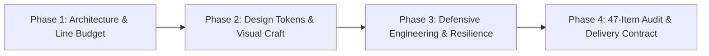

# 🌟 Fullstack Craft Perfection (Universal Engineering & Design Skill Package)

<p align="center">
  <strong>Engineered for AI Coding, Agentic Assistants, and Staff Engineers: Blending Architectural Resilience with Award-Winning Visual Aesthetics</strong>
</p>

<p align="center">
  
  
  
  
  
</p>

---

## 📖 Overview

In the era of AI-assisted software engineering, Large Language Models frequently suffer from critical pitfalls: **over-engineering (turning 100 lines into 500 lines), zombie code accumulation, reinventing existing utilities, hallucinating API endpoints and schemas, introducing catastrophic regressions (blind blast radius), and producing superficial "happy-path" code with hidden edge-case bugs**.

**Fullstack Craft Perfection** is an out-of-the-box **Systemic Engineering Skill Package & Rule Framework**. It fuses the **defensive engineering resilience of a Staff/Principal Systems Architect** with the **world-class visual craft of an Award-Winning Design Director (Awwwards / Webby / FWA tier)**. It is specifically designed to guide and constrain AI agents (such as Google Antigravity, Cursor, Claude Code, Windsurf) to produce production-grade, maintainable software.

---

## 🎯 11 Core AI Coding Pitfalls & Rigid Solutions

| # | Typical AI Flaw / Antipattern | Rigid Engineering Solution Imposed by this Framework |
|---|---|---|
| 1 | **Code Accumulation & Bloat** | **Clean-Cut Refactoring**: Migrations must completely eradicate legacy code. Never leave both architectures half-implemented. |
| 2 | **Reinventing the Wheel** | **Pre-Coding Asset Audit**: Mandatory search for existing utilities before coding. Prioritize reuse and extension. |
| 3 | **Lack of Global Understanding** | **Precise Execution Tracing**: Trace logic strictly from runtime entry points down to active source files. Zero blind patchworks. |
| 4 | **Architectural Erosion** | **Tiered Line Budget** (1200~1800 std, 3000 max, `.po` files exempt) + **Upfront Composition**. |
| 5 | **Multiple Fragmented Implementations** | **Single Source of Truth (SSOT)**: Core business computations must have exactly one authoritative implementation. |
| 6 | **Style & Design Drift** | **Seamless Style Integration + Systematic Design Tokens**: All arbitrary magic numbers converge into CSS Variables. |
| 7 | **Regressions & Side Effects** | **Blast Radius Audit**: Modifying shared code mandates reverse-searching all callers to ensure backward compatibility. |
| 8 | **Over-engineering (YAGNI)** | **Occam's Razor & Code Economy (KISS)**: Eliminate speculative abstractions, redundant wrappers, and bloated factories. |
| 9 | **Localized Tunnel Vision** | **Holistic Architectural Perspective**: Reason globally about transactions, state lifecycles, and graceful shutdowns. |
| 10 | **Difficult Debugging** | **End-to-End Tracing (Trace-ID) + Root Cause Debugging**: Strictly forbid suppressing errors with blind `try-catch` blocks. |
| 11 | **Silent Edge-Case Bugs** | **Full Edge-Case Simulation** (Null/0/Negatives/Overflows) + **Unidirectional State Machines** + **Server-Side Idempotency**. |

---

## 🏗️ Repository Structure

```bash
fullstack-craft-perfection-en/
├── SKILL.md                          # Core skill definition and 47-item verification checklist workflow
├── README.md                         # Main documentation and framework guide
├── LICENSE                           # MIT Open Source License
├── references/                       # In-depth architectural & design specifications
│   ├── design-tokens.css             # Industrial-grade CSS variables (palettes, 4px grid, bezier curves)
│   ├── ui-8-states-guide.md          # World-class UI 8-state interaction lifecycle guide
│   └── backend-resilience.md         # Backend resilience: Idempotency, DTO defense, soft deletes, Trace-ID
└── examples/
    └── award-winning-component.html  # Zero-dependency award-winning interactive showcase component
```

---

## ⚡ Four-Phase Engineering Workflow



### Phase 1: Upfront Architecture & Modular Line Budget
- **Tiered Physical Line Budget**: Standard files stay within `1200 ~ 1800` lines; complex containers and core domain services up to `2500 ~ 3000` lines (mandatory decomposition only when exceeding 3000 lines); functions stay within `120 ~ 150` lines (up to 200 for state machines/transactions).
- **Explicit Exemptions**: Localization catalogs (`.po`, `.pot`, `.mo`, i18n JSONs), database schema definitions, and third-party dependencies are exempt.
- **Upfront Composition**: Frontend views act as assembly containers; backend controllers dispatch, while services encapsulate domains.
- **Occam's Razor (KISS & Anti-YAGNI)**: Eliminate speculative multi-layer factories or empty wrappers. Every line must provide tangible business value.

### Phase 2: Design Systems & Award-Winning Craft
- **Design Tokens Driven & Anti-AI Slop Palette**: Converge global colors, spacing, typography, and radiuses into CSS variables. Decisively ban generic purple-blue gradients, cyberpunk neon glows, and muddy/dirty yellows. Non-dark interfaces must stay luminous, clean, and crisp (never muddy or dull gray); dark themes use 4-tier surface depths rather than void black. Standardize on engineered Warm Amber feedback and a single hero accent.
- **Complete 8-State UI Lifecycle**: Full coverage across `Default`, `Hover`, `Active`, `Focus-Visible`, `Skeleton/Loading`, `Empty`, `Error`, and `Disabled`.
- **GPU Compositing Laws**: Restrict transitions to `transform` and `opacity` with calibrated cubic-bezier curves for silky 60/120fps motion.
- **Microcopy Economy**: Action buttons strictly maintain **2 to 6 words / characters** (max 8), tags **2 to 4 words**, with `white-space: nowrap;`.
- **Zero Native Emojis**: Never use native emojis as functional icons. Support standard inline SVGs, Alibaba Iconfont (`iconfont icon-xxx`), Remix Icon, FontAwesome, and dynamic CDN configuration.

### Phase 3: Defensive Engineering & System Resilience
- **Row-Level Ownership Validation (IDOR Defense)**: Scope non-admin queries and mutations to the authenticated user context.
- **Soft Deletes for Core Assets**: Avoid physical `DELETE`; use `deleted_at TIMESTAMP NULL` with compound unique keys.
- **PII Masking & Log Sanitization**: Mask personal data on user interfaces and sanitize sensitive credentials in logs.
- **Non-Destructive Expand-Contract Migrations**: DDL migrations must be idempotent and follow zero-downtime Expand-Contract phases.
- **100% Real-World Third-Party API Grounding**: Never invent request URLs, parameters, or response fields.
- **Server-Side Write Idempotency**: Three lines of defense: in-flight mutex locks, database unique constraints, and unidirectional state machines.
- **End-to-End Tracing & Graceful Shutdown**: Propagate `Trace-ID` everywhere; worker processes handle `SIGTERM`/`SIGINT`.

---

## 📋 Master 47-Item Verification Checklist

Before delivering code, verify every item on this checklist:

```markdown
1.  [ ] Was the runtime execution path traced directly to active source files rather than relying on speculative keyword searches?
2.  [ ] Was the "No Local PHP Execution" rule respected (if applicable)?
3.  [ ] Are third-party API calls (endpoints, parameters, headers, signatures, response schemas) 100% aligned with official documentation with zero hallucinations?
4.  [ ] Does new or modified code match the established architectural patterns without introducing incompatible paradigms?
5.  [ ] Were CSS modifications made directly in-place rather than appended as overrides at the bottom?
6.  [ ] Are all database queries parameterized via prepared statements with zero string concatenation?
7.  [ ] Are all dynamic HTML outputs sanitized against XSS?
8.  [ ] Is the codebase completely free of hardcoded API keys, passwords, and secrets?
9.  [ ] Are critical comments and historical business logic preserved?
10. [ ] Are errors safely intercepted and logged server-side without leaking stack traces to users?
11. [ ] Are DOM elements checked for null before manipulation in JavaScript?
12. [ ] Were modifications executed directly via native file editing tools rather than interim Python/Shell scripts? Is the workspace completely free of temporary .py scripts, .bak, or test files?
13. [ ] Do external HTTP requests configure explicit timeouts and resilient fallback handling?
14. [ ] Are high-frequency endpoints protected by caching and rate limiting?
15. [ ] Do all database updates/deletes specify a `WHERE` clause, and do queries specify `LIMIT`?
16. [ ] Is backward compatibility preserved for existing API consumers?
17. [ ] Are cookies configured with `HttpOnly`, `SameSite`, and `Secure` attributes?
18. [ ] Are all files saved in UTF-8 without BOM?
19. [ ] Are sensitive configuration files protected within `.gitignore`?
20. [ ] Do API endpoints uniformly return `{code, msg, data}` with `application/json` headers?
21. [ ] Is the UI responsive across mobile devices, and is button microcopy economical (2-6 words, max 8, `white-space: nowrap`)?
22. [ ] Are file and network handles deterministically closed in `finally` blocks?
23. [ ] Are multibyte string operations safely handled using `mb_*` functions?
24. [ ] Are scheduled tasks and background jobs protected by idempotency and re-entrancy locks?
25. [ ] Is the user interface completely free of internal variable names, debug traces, or AI prompt text?
26. [ ] Do business files stay within tiered line budgets (1200-1800 std, 3000 max, .po exempt), and functions within 150-200 lines?
27. [ ] Are loop bodies free of database queries and outbound HTTP calls?
28. [ ] Are variables and properties strictly validated for non-null types before access?
29. [ ] Are domain names, IP addresses, and paths fully decoupled from application logic?
30. [ ] Are dependency lockfiles committed and preserved?
31. [ ] Are multi-table mutations enclosed in atomic database transactions with rollback on failure?
32. [ ] Does the UI decisively eliminate "AI-slop" purple-blue gradients and muddy yellows? Is the color palette balanced, comfortable (glare-free, luminous in light mode without murkiness), and structured with a single hero accent and surface depth?
33. [ ] Are styles driven by systematic Design Tokens with complete 8-state UI lifecycles?
34. [ ] Are external payloads normalized before rendering, and are lifecycle listeners/timers 100% cleaned up?
35. [ ] Do backend endpoints enforce strict DTO whitelists, and are critical write operations idempotent?
36. [ ] Is Trace-ID logging observable across the full call chain, with jittered retry backoffs and graceful shutdown?
37. [ ] Do media uploads include pre-compression and dimension budgets with EXIF sanitization?
38. [ ] Are fullstack performance budgets honored (selective projection, virtualization, lazy loading, $O(N)$ hash indexes)?
39. [ ] Are native emojis avoided as functional UI icons, with standardized prefixes (Alibaba Iconfont, Remix, FontAwesome) and CDN configurability supported?
40. [ ] Are row-level ownership checks (IDOR defense), soft deletes, PII masking, and non-destructive migrations implemented?
41. [ ] Was Occam's Razor (KISS) respected, avoiding speculative over-engineering and bloated abstractions?
42. [ ] Was a clean-cut refactoring executed, removing 100% of deprecated code from earlier approaches?
43. [ ] Do all invoked APIs and syntaxes match target runtime environments without deprecated calls or hallucinations?
44. [ ] Does the implementation demonstrate a holistic architectural view, reusing established infrastructure?
45. [ ] Was the blast radius evaluated by reverse-searching call hierarchies before modifying shared components?
46. [ ] Was a pre-coding asset audit performed to avoid duplicate implementations and maintain a Single Source of Truth?
47. [ ] Were all edge cases simulated (nulls, zero, negatives, concurrency, timeouts) with debugging focused on root causes?
```

---

## 📄 License

MIT License. See [LICENSE](./LICENSE) for details.
