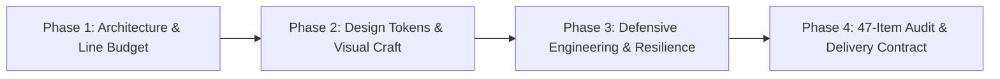

# Fullstack Craft Perfection (Universal Engineering & Design Skill Package)

This skill package is engineered to fuse **production-grade resilience (Staff/Principal Engineer tier)** with **world-class visual craft and aesthetics (Awwwards / Webby / FWA Tier)**. It applies universally across any technology stack, framework, or architectural scale.

---

## Core Workflow: Four-Phase Delivery Lifecycle

---

## Phase 1: Upfront Architecture & Modular Line Budget

Before authoring code, establish **Upfront Composition** to decisively eliminate monolithic God Files:

1. **Tiered Physical Line Budget**:
   - **Standard Business Files (Subcomponents, Controllers, Models, Utilities)**: Keep within `1200 ~ 1800` lines.
   - **Complex Core Files (Multi-state containers, large SPAs, core trading domain services)**: Healthy target within `1800 ~ 2500` lines; absolute physical ceiling set at **3000 lines**. (Enforce decomposition only when exceeding 3000 lines; do not prematurely fragment cohesive code into dozens of tiny files).
   - **Function Granularity**: Keep individual methods within `120 ~ 150` lines (up to `200` lines for atomic transaction flows, state machines, or complex algorithms).
2. **Upfront Decomposition & Composition**:
   - **Complex Frontend Views**: The root page serves strictly as an **assembly container**; partition sub-features into dedicated subcomponents, and extract state/network logic into custom Hooks/Stores/Services.
   - **Complex Backend Domains**: Controllers only handle parameter validation and response envelopes; domain logic resides in dedicated Services; persistence belongs in Models/Repositories; algorithmic helpers live in Utilities.
3. **Explicit Exemptions**:
   - **Localization & Language Files**: Multi-language translation catalogs (`.po`, `.pot`, `.mo`, i18n JSON dictionaries, language mapping arrays) are **100% exempt** from line limits.
   - **External Dependencies & Generated Bundles**: Vendor packages (`vendor/`, `node_modules/`), compiled build targets (`dist/`), and static database table column schemas are exempt.
4. **Holistic System Architecture & Anti-Overengineering (KISS & Anti-YAGNI)**:
   - **Holistic System Vision**: Understand domain boundaries, lifetimes, and dependencies globally. Reuse established infrastructure; never fragment the codebase by writing redundant micro-utilities.
   - **Occam's Razor & KISS**: Prefer the most straightforward, flat, and intuitive implementation. If 100 lines solve the problem cleanly, never author 500 lines of multi-layered factories, wrappers, or speculative abstractions (YAGNI).

---

## Phase 2: Design Systems & World-Class Visual Craft

All interface engineering and micro-interactions must aspire to the caliber of **Awwwards, Webby Awards, and FWA winners**:

1. **Systematic Design Tokens Driven (Zero Magic Numbers)**:
   - Interface styling must be built upon systematic CSS Variables (palette scales, 4px grid rhythm, fluid typography, glow shadows, and refined bezier easings);
   - Standard reference token pool: [design-tokens.css](./references/design-tokens.css).
2. **Complete 8-State UI Lifecycle**:
   - Every interactive or asynchronous data component must design for and implement the 8-state closed loop:
     `Default` → `Hover` → `Active/Press` → `Focus-Visible` → `Skeleton/Loading` → `Empty` → `Error/Fallback` → `Disabled`;
   - Full implementation guide: [ui-8-states-guide.md](./references/ui-8-states-guide.md).
3. **Motion Physics & GPU Compositing Laws**:
   - **Restricted Properties**: Animations and transitions are strictly confined to `transform` and `opacity`. Never animate layout or box-model properties that trigger reflow (Reflow/Layout).
   - **Tailored Bezier Curves**: Utilize calibrated cubic-bezier curves (e.g., `cubic-bezier(0.16, 1, 0.3, 1)`), guaranteeing silky 60/120fps motion.
4. **Mobile Responsiveness & Microcopy Economy**:
   - Never hardcode fixed pixel widths that produce horizontal scrollbars on mobile devices;
   - **Microcopy Word Budget**: Action buttons must stay within **2 to 6 words / characters** (e.g., "Save", "Confirm Payment", "Download Report"); complex or chained actions must **never exceed 8 words / characters**; tags/badges stay within **2 to 4 words / characters**. Explanations belong in helper text below the button, not crammed inside it;
   - **No-Wrap Guarantee**: Enforce `white-space: nowrap;` on buttons and badges to prevent distorted wrapping on compact viewports;
   - Mobile touch targets must guarantee at least $\ge 44 \times 44\text{px}$.
5. **UI Icon Engineering & Zero Native Emojis (Zero-Emoji Standardization)**:
   - Strictly prohibit using native emojis (🚀, 💡, 🔥, ⚙️, ❌, ✅) as interactive functional icons (preventing fragmented cross-platform rendering and degraded aesthetic credibility);
   - Core built-in icons should prefer inline vector `<svg>` (supporting `currentColor` inheritance and zero extra HTTP requests);
   - **Comprehensive Ecosystem Support**: Support **Alibaba Iconfont (`iconfont icon-xxx`)**, **Remix Icon (`ri-xxx-line` / `ri-xxx-fill`)**, **FontAwesome (`fa-solid fa-xxx`)**, and **Iconify (`<iconify-icon icon="xxx">`)** with strict class prefix namespacing;
   - **Dynamic CDN Decoupling**: Support dynamic admin configuration of external icon CDN stylesheets and icon class names, backed by graceful local SVG fallback placeholders.

---

## Phase 3: Defensive Engineering & System Resilience

1. **Pre-Render Data Normalization (Data Normalizer)**:
   - External asynchronous payloads must pass through an adaptation layer before injecting into views;
   - Provide safe fallback defaults and type guards to eliminate `undefined` exceptions, broken media, or raw `NaN` strings in the DOM.
2. **Symmetric Lifecycle Cleanup (Zero Memory Leaks)**:
   - When components unmount, symmetrically detach all `addEventListener`, clear `setInterval`/`setTimeout`, disconnect `IntersectionObserver`/`ResizeObserver`, and destroy third-party chart/canvas instances.
   - Enforce debouncing/throttling and in-flight request mutex locks on high-frequency form submissions.
3. **Strict DTO Isolation (Mass Assignment Defense)**:
   - Enforce explicit DTO or whitelist schema validation between boundary layers and business domains, blocking unauthorized parameters from reaching models or persistence.
4. **Server-Side Write Idempotency**:
   - Critical state-mutating operations (payments, orders, asset adjustments) must enforce idempotency on the server using unique database indexes, idempotency keys, or distributed locks.
5. **End-to-End Tracing (Trace-ID) & Graceful Shutdown**:
   - Ingress requests must allocate or propagate a unique `Trace-ID` across logs, audits, and RPC/API calls;
   - Outbound dependency retries must implement **exponential backoff with randomized jitter**;
   - Daemons and message queue workers must capture `SIGTERM`/`SIGINT` signals for graceful shutdown.
6. **Pre-Upload Media Compression, Dimension Budgets & Security**:
   - Image uploads must configure pre-compression by default (client-side Canvas downscaling to max 1920px/1280px, quality 0.8~0.85, WebP/JPEG);
   - Server-side pipelines must validate authentic magic bytes and strip privacy-sensitive EXIF metadata (especially GPS coordinates).
7. **Fullstack Performance Budget & Complexity Control**:
   - Avoid `SELECT *` in high-volume paths; fetch bulky text/JSON blobs on demand;
   - Datasets exceeding 50~100 items must use virtualization or progressive pagination;
   - Non-critical media must declare `loading="lazy"` and `decoding="async"`;
   - Search inputs must debounce (300~500ms); viewport tracking must use `IntersectionObserver`;
   - Correlating multiple datasets must build Hash Maps/Dictionaries for $O(1)$ lookups, avoiding $O(N^2)$ nested loops.
8. **Row-Level Authorization, Soft Delete & Safe Migrations**:
   - **Row-Level Ownership (IDOR Defense)**: Scope non-admin resource mutations to the authenticated user context (e.g., `WHERE id = :id AND user_id = :current_user_id`);
   - **Soft Delete for Core Assets**: Do not physically `DELETE` core business records; utilize `deleted_at TIMESTAMP NULL` with compound unique keys;
   - **PII Masking**: Mask phone numbers, ID cards, and emails on user-facing interfaces and sanitize credentials in server logs;
   - **Expand-Contract Migrations**: DDL migrations must be idempotent and follow zero-downtime Expand-Contract phases.
9. **Clean-Cut Refactoring & Zero API Hallucination**:
   - **Clean-Cut Cutover**: When migrating from Architecture A to Architecture B, completely remove all code related to Solution A, maintaining a single source of truth;
   - **Dependency Alignment**: Align code with target environment runtime versions and dependencies; never invoke deprecated APIs or invent hallucinated function signatures.
10. **Blast Radius Audit, Pre-Coding Search & Root-Cause Debugging**:
    - **Blast Radius Audit**: Reverse-search call hierarchies before modifying shared components, ensuring backward compatibility;
    - **Pre-Coding Asset Audit (SSOT)**: Check existing codebase utilities before authoring new ones; reuse and extend existing assets;
    - **Edge-Case Simulation & Root-Cause Debugging**: Simulate edge cases (nulls, zero, negatives, concurrency, timeouts) and fix root causes rather than applying superficial patches.

---

## Phase 4: 47-Item Audit & Delivery Contract

Every code contribution or refactoring task must verify against this 47-item checklist and conclude with a formal verification receipt:

### Master 47-Item Checklist
1. [ ] Was the runtime execution path traced directly to active source files rather than relying on speculative keyword searches?
2. [ ] Was the "No Local PHP Execution" rule respected (if applicable)?
3. [ ] Are third-party API calls (endpoints, parameters, headers, signatures, response schemas) 100% aligned with official documentation with zero hallucinations?
4. [ ] Does new or modified code match the established architectural patterns without introducing incompatible paradigms?
5. [ ] Were CSS modifications made directly in-place rather than appended as overrides at the bottom?
6. [ ] Are all database queries parameterized via prepared statements with zero string concatenation?
7. [ ] Are all dynamic HTML outputs sanitized against XSS?
8. [ ] Is the codebase completely free of hardcoded API keys, passwords, and secrets?
9. [ ] Are critical comments and historical business logic preserved?
10. [ ] Are errors safely intercepted and logged server-side without leaking stack traces to users?
11. [ ] Are DOM elements checked for null before manipulation in JavaScript?
12. [ ] Is the working directory free of temporary `.bak` or test files?
13. [ ] Do external HTTP requests configure explicit timeouts and resilient fallback handling?
14. [ ] Are high-frequency endpoints protected by caching and rate limiting?
15. [ ] Do all database updates/deletes specify a `WHERE` clause, and do queries specify `LIMIT`?
16. [ ] Is backward compatibility preserved for existing API consumers?
17. [ ] Are cookies configured with `HttpOnly`, `SameSite`, and `Secure` attributes?
18. [ ] Are all files saved in UTF-8 without BOM?
19. [ ] Are sensitive configuration files protected within `.gitignore`?
20. [ ] Do API endpoints uniformly return `{code, msg, data}` with `application/json` headers?
21. [ ] Is the UI responsive across mobile devices, and is button microcopy economical (2-6 words, max 8, `white-space: nowrap`)?
22. [ ] Are file and network handles deterministically closed in `finally` blocks?
23. [ ] Are multibyte string operations safely handled using `mb_*` functions?
24. [ ] Are scheduled tasks and background jobs protected by idempotency and re-entrancy locks?
25. [ ] Is the user interface completely free of internal variable names, debug traces, or AI prompt text?
26. [ ] Do business files stay within tiered line budgets (1200-1800 std, 3000 max, .po exempt), and functions within 150-200 lines?
27. [ ] Are loop bodies free of database queries and outbound HTTP calls?
28. [ ] Are variables and properties strictly validated for non-null types before access?
29. [ ] Are domain names, IP addresses, and paths fully decoupled from application logic?
30. [ ] Are dependency lockfiles committed and preserved?
31. [ ] Are multi-table mutations enclosed in atomic database transactions with rollback on failure?
32. [ ] Was the UI and micro-interaction polish benchmarked against Awwwards/Webby/FWA standards?
33. [ ] Are styles driven by systematic Design Tokens with complete 8-state UI lifecycles?
34. [ ] Are external payloads normalized before rendering, and are lifecycle listeners/timers 100% cleaned up?
35. [ ] Do backend endpoints enforce strict DTO whitelists, and are critical write operations idempotent?
36. [ ] Is Trace-ID logging observable across the full call chain, with jittered retry backoffs and graceful shutdown?
37. [ ] Do media uploads include pre-compression and dimension budgets with EXIF sanitization?
38. [ ] Are fullstack performance budgets honored (selective projection, virtualization, lazy loading, $O(N)$ hash indexes)?
39. [ ] Are native emojis avoided as functional UI icons, with standardized prefixes (Alibaba Iconfont, Remix, FontAwesome) and CDN configurability supported?
40. [ ] Are row-level ownership checks (IDOR defense), soft deletes, PII masking, and non-destructive migrations implemented?
41. [ ] Was Occam's Razor (KISS) respected, avoiding speculative over-engineering and bloated abstractions?
42. [ ] Was a clean-cut refactoring executed, removing 100% of deprecated code from earlier approaches?
43. [ ] Do all invoked APIs and syntaxes match target runtime environments without deprecated calls or hallucinations?
44. [ ] Does the implementation demonstrate a holistic architectural view, reusing established infrastructure?
45. [ ] Was the blast radius evaluated by reverse-searching call hierarchies before modifying shared components?
46. [ ] Was a pre-coding asset audit performed to avoid duplicate implementations and maintain a Single Source of Truth?
47. [ ] Were all edge cases simulated (nulls, zero, negatives, concurrency, timeouts) with debugging focused on root causes?

---

## Bundled Engineering Assets

* **Standard Design Tokens Pool**: [design-tokens.css](./references/design-tokens.css)
* **UI 8-State Lifecycle Specification**: [ui-8-states-guide.md](./references/ui-8-states-guide.md)
* **Backend Resilience & Architecture Guide**: [backend-resilience.md](./references/backend-resilience.md)
* **Award-Winning Interactive Showcase**: [award-winning-component.html](./examples/award-winning-component.html)
